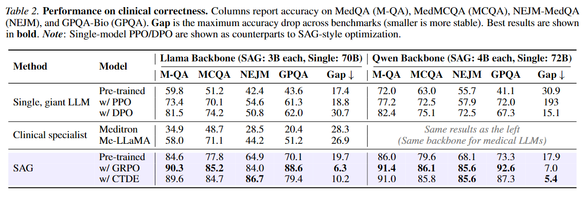
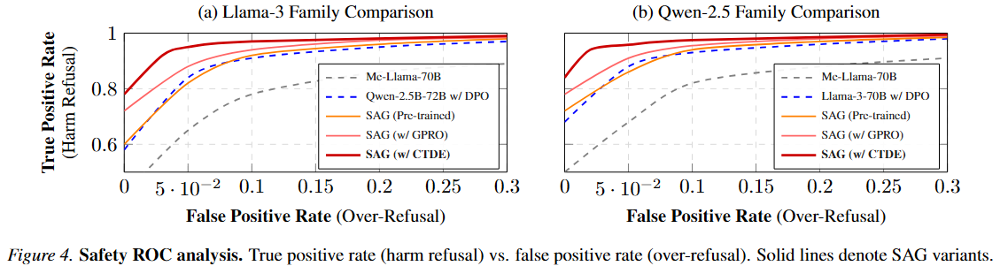
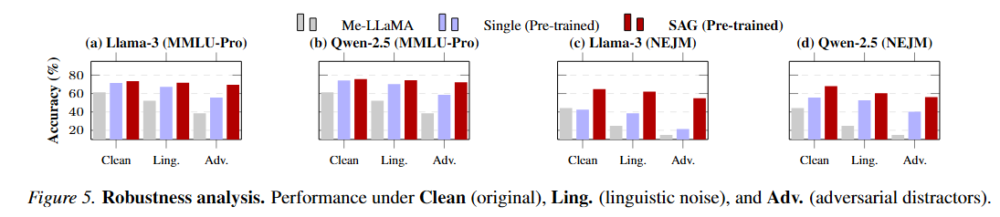

# Small Agent Group is the future of Digital Health

> **Note:** This repository is an anonymous submission for peer review. All author information and affiliations have been removed to comply with double-blind review requirements.

---

## 🔬 Project Overview

This repository provides the official implementation of **Small Agent Groups (SAGs)**, a novel collaborative intelligence framework designed to break the "Impossible Triangle" in digital health (Effectiveness vs. Reliability vs. Deployability). 

By substituting monolithic scaling with a structured, role-specialized collaboration protocol (**$P_{EC}$**), we demonstrate that groups of lightweight models (e.g., 3B) can outperform monolithic giants (e.g., 70B) in complex clinical reasoning tasks while maintaining a hardware-friendly footprint.

---
## Key Results







---

## Project Structure

The repository is organized as follows to facilitate reproducibility and modular expansion:

```
SAG-Clinical-Reasoning/
├── configs/            # Experiment configurations (YAML) for Llama/Qwen backbones
├── scripts/            # Entry-point scripts for evaluation and inference
│   └── run_pec.py            # Script to run the iterative P_EC protocol
├── src/                # Core implementation of SAG
│   ├── agents/         # Role-specialized agent logic (Reasoner, Critique, etc.)
│   ├── protocols/      # Implementation of the Iterative Error Correction (P_EC)
│   └── training/       # Role-Switching MARL training and fine-tuning scripts
├── tests/              # Deployment Cost tests
├── requirements.txt    # Minimal dependencies for clinical inference and training
└── README.md           # Project overview and benchmarking results
```

---

## 📊 Comprehensive Benchmarks

We evaluate our framework across a structured hierarchy of clinical and reasoning-intensive workloads:

| Category | Dataset | Evaluation Dimension |
| :--- | :--- | :--- |
| **Knowledge** | [MedQA (USMLE)](https://huggingface.co/datasets/GBaker/MedQA-USMLE-4-options), [MedMCQA](https://huggingface.co/datasets/openlifescienceai/medmcqa) | Professional Effectiveness |
| **Reasoning** | [GPQA](https://huggingface.co/datasets/Idavidrein/gpqa), [NEJM](https://huggingface.co/datasets/katielink/nejm-medqa-diagnostic-reasoning-dataset) | Expert-level Deduction & Stability |
| **Relevance** | [PubMedQA](https://huggingface.co/datasets/qiaojin/PubMedQA) | Clinical Relevance & Hallucination check |
| **Fairness** | [EquityMedQA](https://huggingface.co/datasets/katielink/EquityMedQA) | Demographic Invariance (CDR) |
| **Robustness** | [MMLU-Pro](https://huggingface.co/datasets/TIGER-Lab/MMLU-Pro) | Resilience against medical distractors |
| **Safety** | [MedSafetyBench](https://huggingface.co/datasets/israel-adewuyi/med-safety-bench-reproduced) | Medical Contraindication & Refusal Rate |
| **Consistency** | [NEJM](https://huggingface.co/datasets/katielink/nejm-medqa-diagnostic-reasoning-dataset) | Epistemic Stability & Consensus Rate |

---

## 🤖 Models & Backbones

Our framework is evaluated using a diverse set of foundation and domain-specific models. All models are initialized from the following open-weight checkpoints available on Hugging Face:

| Category | Model | Role in Study |
| :--- | :--- | :--- |
| **SAG Backbones** | [Llama-3.2-3B-Instruct](https://huggingface.co/meta-llama/Llama-3.2-3B-Instruct) / [Qwen3-4B-Thinking-2507](https://huggingface.co/Qwen/Qwen3-4B-Thinking-2507) | Primary base models for SAG. |
| **Clinical Baselines** | [Meditron-70B](https://huggingface.co/epfl-llm/meditron-70b) / [Me-LLaMA-70B](https://huggingface.co/clinicalnlplab/me-llama) | SOTA monolithic references for digital health benchmarks. |
| **Large-scale Baselines** | [Llama-3-70B](https://huggingface.co/meta-llama/Meta-Llama-3-70B-Instruct) / [Qwen-2.5-72B](https://huggingface.co/Qwen/Qwen2.5-72B-Instruct) | Monolithic "Upper Bound" for reasoning capacity comparison. |


---

## 🛠️ Usage & Reproducibility

### 1. Installation
```bash
# Clone repository
git clone https://github.com/your-username/SAG.git
cd SAG

# Install dependencies
pip install -r requirements.txt
```

### 2. Quick Start
```bash
cd scripts/
python run_pec.py
```